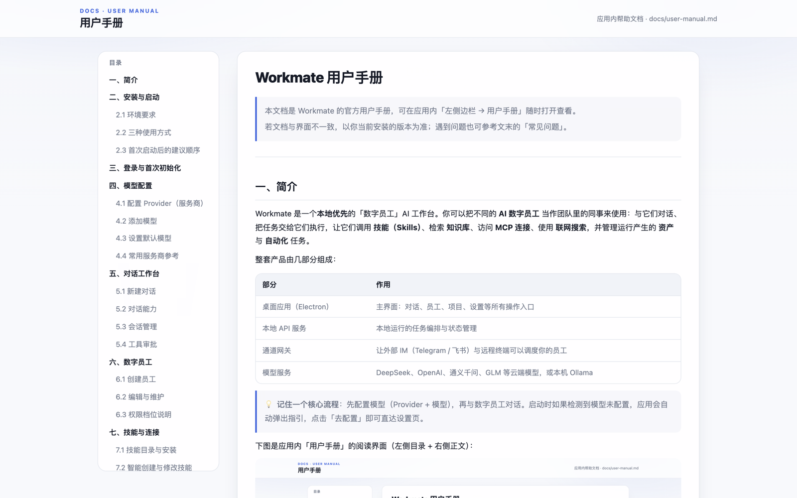
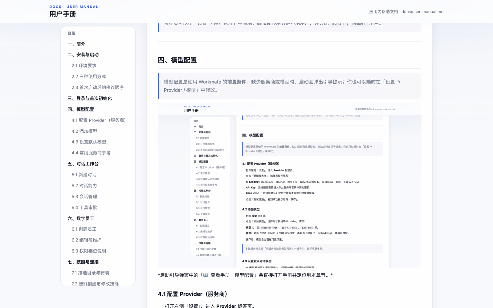
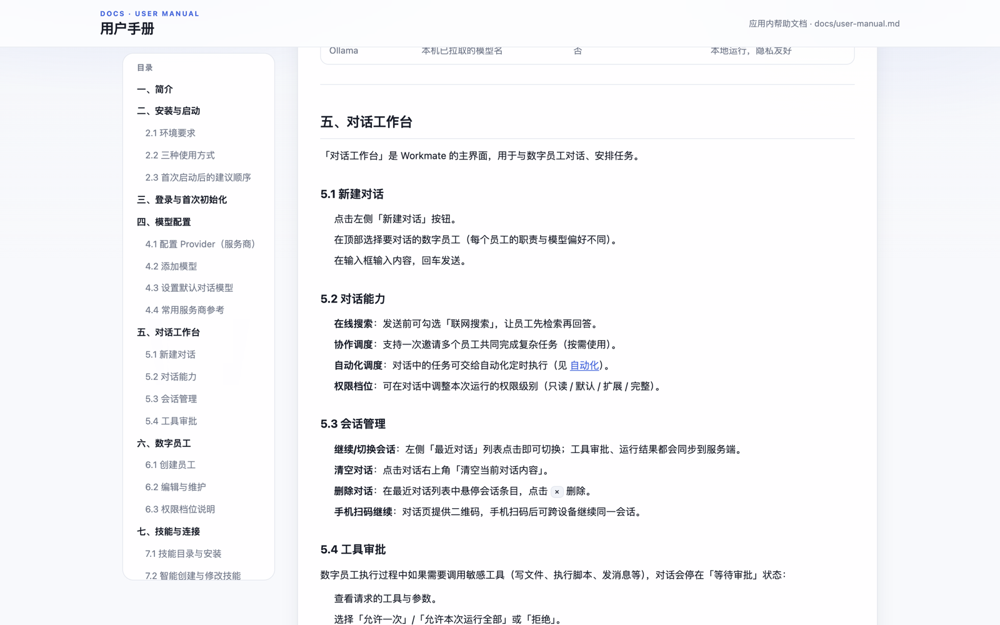
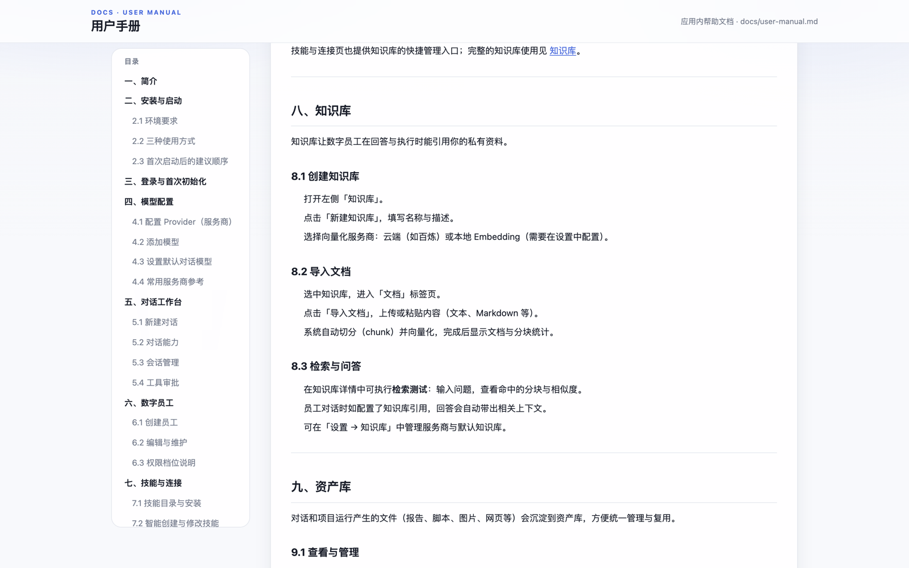
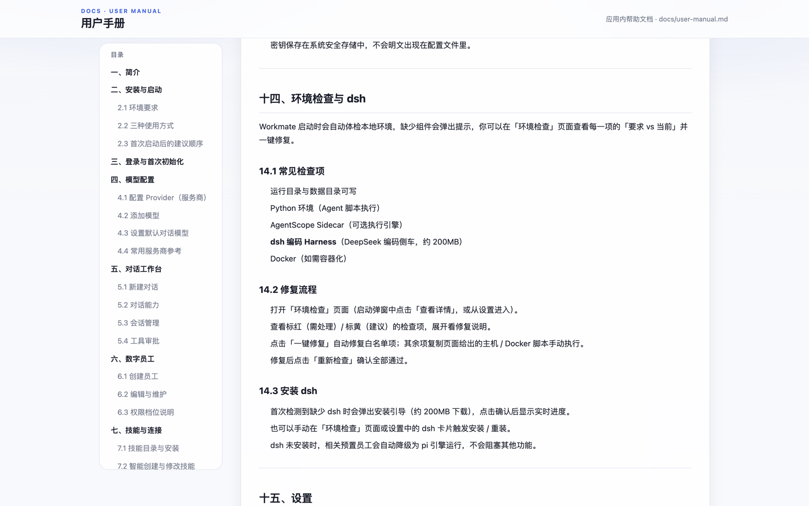
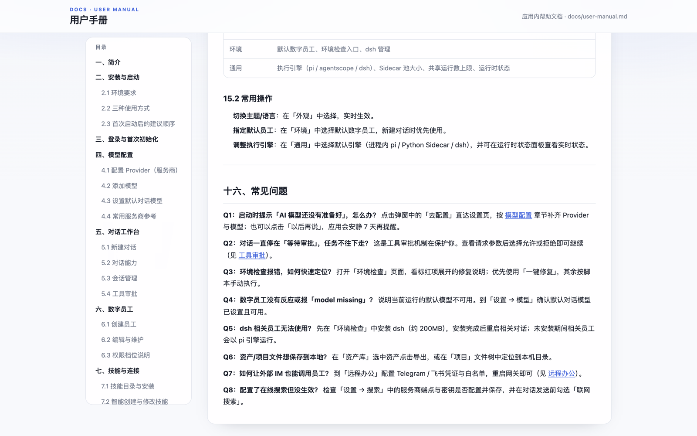

# Workmate 用户手册

> 本文档是 Workmate 的官方用户手册，可在应用内「左侧边栏 → 用户手册」随时打开查看。
> 若文档与界面不一致，以你当前安装的版本为准；遇到问题也可参考文末的「常见问题」。

---

## 一、简介 {#intro}

Workmate 是一个**本地优先**的「数字员工」AI 工作台。你可以把不同的 **AI 数字员工** 当作团队里的同事来使用：与它们对话、把任务交给它们执行，让它们调用 **技能（Skills）**、检索 **知识库**、访问 **MCP 连接**、使用 **联网搜索**，并管理运行产生的 **资产** 与 **自动化** 任务。

整套产品由几部分组成：

| 部分 | 作用 |
| --- | --- |
| 桌面应用（Electron） | 主界面：对话、员工、项目、设置等所有操作入口 |
| 本地 API 服务 | 本地运行的任务编排与状态管理 |
| 通道网关 | 让外部 IM（Telegram / 飞书）与远程终端可以调度你的员工 |
| 模型服务 | DeepSeek、OpenAI、通义千问、GLM 等云端模型，或本机 Ollama |

> 💡 **记住一个核心流程**：先配置模型（Provider + 模型），再与数字员工对话。启动时如果检测到模型未配置，应用会自动弹出指引，点击「去配置」即可直达设置页。

下图是应用内「用户手册」的阅读界面（左侧目录 + 右侧正文）：



---

## 二、安装与启动 {#install}

### 2.1 环境要求

- 操作系统：macOS / Windows / Linux
- Node.js ≥ 22（源码方式运行时）
- Python ≥ 3.10（可选，使用 AgentScope Sidecar 执行引擎时）
- Docker（可选，容器化部署时）

### 2.2 三种使用方式

**方式一：桌面安装包（推荐）**

从发布页下载对应平台的安装包并安装。macOS 安装包目前未签名，如果系统阻止启动，请在终端执行：

```bash
xattr -cr "/Applications/Workmate.app"
```

如果应用尚未拖入 `Applications`，也可对下载目录中的 `.app` 执行同样的命令后再打开。

**方式二：npm / CLI（Web Launcher）**

```bash
npm install -g @next-open-ai/workmate
workmate doctor   # 检查本地环境
workmate init     # 初始化配置
workmate start    # 启动 Web 版
```

**方式三：源码开发**

```bash
pnpm install
pnpm dev          # 构建 workspace 包，再拉起 Vite + Electron
```

### 2.3 首次启动后的建议顺序

1. 完成登录或初始化本地管理员（见 [登录与首次初始化](#login)）。
2. 配置模型服务商与对话模型（见 [模型配置](#model-config)）。
3. 运行一次环境检查，按提示补齐缺失项（见 [环境检查与 dsh](#env-check)）。
4. 开始与数字员工对话（见 [对话工作台](#chat)）。

---

## 三、登录与首次初始化 {#login}

Workmate 使用本地账号体系。首次启动时：

1. 打开应用，进入登录页。
2. 如果是**第一次使用**，页面会显示「初始化本地管理员」：填写组织标识（orgId）、管理员用户名、显示名与密码，点击「初始化完成」。
3. 之后每次启动只需输入用户名与密码登录。

> 管理员可以在「设置 → 用户管理」中新增、编辑或停用其他本地用户，并分配 `admin` / `member` 角色。

---

## 四、模型配置 {#model-config}

> 模型配置是使用 Workmate 的**前置条件**。缺少服务商或模型时，启动会弹出引导提示；你也可以随时在「设置 → Provider / 模型」中修改。



*启动引导弹窗中的「📖 查看手册：模型配置」会直接打开手册并定位到本章节。*

### 4.1 配置 Provider（服务商）

1. 打开左侧「设置」，进入 **Provider** 标签页。
2. 点击「新增服务商」，选择类型并填写：
   - **服务商类型**：共支持 8 种——OpenAI、Anthropic（Claude）、Google（Gemini）、DeepSeek、GLM（智谱）、通义千问（Qwen）、Ollama（本机，无需 API Key）、OpenAI 兼容（任意兼容接口，适合企业网关或自建代理）。
   - **API Key**：云端服务需要填入你从服务商官网申请的密钥；Ollama 不需要。
   - **Base URL**：一般保持默认；使用代理或兼容接口时按需修改。
3. 点击「测试连通」，看到成功提示后再保存。就绪的服务商显示绿色「已就绪」标签，缺少必填项则显示黄色「待完善」。
4. 保存后仍可随时点「编辑」修改：切换供应商类型时，默认地址与必填项会自动联动；展开编辑面板还可勾选「禁用思考模式」（对部分推理模型生效，可减少思考过程输出）。

> 删除某个 Provider 时，与之关联的已配置模型会在保存时一并清理，请谨慎操作。

### 4.2 添加模型

1. 切到 **模型** 标签页，点击「添加模型」。
2. 选择已就绪的 Provider，再选择**能力**：
   - **chat（对话）**：日常对话与任务执行使用。
   - **image（生图）**：图片生成（如 OpenAI 的 `gpt-image-1`）。
   - **embedding（向量化）**：知识库语义检索使用。
   - **asr（语音识别）/ tts（语音合成）**：语音相关能力。
3. 填写或从下拉候选中选择 **模型 ID**（如 `deepseek-chat`、`gpt-4.1-mini`、`qwen-plus`）。
4. 多数云端服务商支持「从服务商拉取模型列表」一键导入，比手填更省事。
5. 保存后，模型会出现在可选项里；新添加的对话 / 向量化模型默认自动成为对应能力的默认模型。

> **embedding 模型**保存后可在列表中补充元数据（维度、单批最大条数、输入字符上限、是否归一化），并点击「测试 Embedding」验证连通与维度。

### 4.3 设置默认模型

1. **默认对话模型**：在模型列表中找到目标对话模型，点击「设为默认对话模型」。新建对话默认使用它；对话输入栏右侧的下拉框可临时切换本次对话使用的模型（显示为「服务商 · 模型」）。
2. **默认向量化模型**：embedding 模型通过列表中的单选按钮设为默认，知识库检索会优先使用它。
3. 在「数字员工」详情页还可以为单个员工指定专属默认模型（见 [数字员工](#employees) 章节）。

### 4.4 常用服务商参考

| 服务商 | 典型对话模型 | 是否需要 API Key | 备注 |
| --- | --- | --- | --- |
| DeepSeek | `deepseek-chat` | 是 | 性价比高 |
| OpenAI | `gpt-4.1-mini` | 是 | 能力全面，另有生图 / 语音模型 |
| Anthropic | `claude-sonnet-4-5` | 是 | Claude 系列 |
| Google | `gemini-2.5-flash` | 是 | Gemini 系列 |
| 通义千问 | `qwen-plus` | 是 | 阿里云百炼 |
| GLM | `glm-4.5-flash` | 是 | 智谱 AI |
| Ollama | 本机已拉取的模型名 | 否 | 本地运行，隐私友好 |
| OpenAI 兼容 | 视服务而定 | 视服务而定 | 兼容 OpenAI 协议的网关 / 代理 |

---

## 五、对话工作台 {#chat}

「对话工作台」是 Workmate 的主界面，用于与数字员工对话、安排任务。



### 5.1 新建对话

1. 点击左侧「新建对话」按钮。
2. 在顶部选择要对话的数字员工（每个员工的职责与模型偏好不同）。
3. 在输入框输入内容，回车发送。

### 5.2 对话能力

- **在线搜索**：发送前可勾选「联网搜索」，让员工先检索再回答。
- **协作调度**：支持一次邀请多个员工共同完成复杂任务（按需使用）。
- **自动化调度**：对话中的任务可交给自动化定时执行（见 [自动化](#automations)）。
- **权限档位**：可在对话中调整本次运行的权限级别（只读 / 默认 / 扩展 / 完整）。

### 5.3 会话管理

- **继续/切换会话**：左侧「最近对话」列表点击即可切换；工具审批、运行结果都会同步到服务端。
- **清空对话**：点击对话右上角「清空当前对话内容」。
- **删除对话**：在最近对话列表中悬停会话条目，点击 `×` 删除。
- **手机扫码继续**：对话页提供二维码，手机扫码后可跨设备继续同一会话。

### 5.4 工具审批

数字员工执行过程中如果需要调用敏感工具（写文件、执行脚本、发消息等），对话会停在「等待审批」状态：

1. 查看请求的工具与参数。
2. 选择「允许一次」/「允许本次运行全部」或「拒绝」。
3. 批准后任务自动继续执行，无需重新发起。

---

## 六、数字员工 {#employees}

数字员工是任务的执行主体。每个员工可以有自己的名字、头像、职责说明、默认模型与技能组合。

### 6.1 创建员工

1. 打开左侧「数字员工」。
2. 点击「新建员工」。
3. 填写名称、头像（可选）、职责描述，选择默认模型与权限档位。
4. 保存后即可在对话工作台中选择该员工。

### 6.2 编辑与维护

- **编辑**：在员工详情页修改资料、模型、权限。
- **绑定技能/MCP**：给员工勾选可用的 Skills 与 MCP 连接器，员工执行任务时才有对应能力。
- **重置**：恢复该员工的系统默认配置。
- **删除**：移除自定义员工；系统预置员工不可删除。

### 6.3 权限档位说明

| 档位 | 说明 |
| --- | --- |
| read-only | 只读：不能写文件、执行脚本、调用外部工具 |
| default | 默认：常规操作 |
| extended | 扩展：更多工具权限 |
| full | 完整：放开大多数敏感操作 |

---

## 七、技能与连接 {#capabilities}

「技能与连接」集中管理员工的工具箱：技能（Skills）、MCP 连接器与知识库入口。

### 7.1 技能目录与安装

1. 打开「技能与连接」。
2. 在**技能目录**中浏览或搜索可用技能。
3. 点击技能查看详情（功能说明、作者、安装量），确认后点击「安装」。
4. 安装完成后，在「数字员工」详情页勾选该技能即可启用。

### 7.2 智能创建与修改技能

如果你会写提示词，可以让 AI 帮你创建或修改技能：

1. 在「技能与连接」中找到「智能创建与修改」入口。
2. 描述你想要的技能名称与功能，或粘贴现有技能草稿。
3. 生成后检查、微调并保存，技能会进入你的本地技能库。

### 7.3 MCP 连接器

MCP（Model Context Protocol）让员工能接入外部系统：

1. 打开「MCP 连接器」面板，点击「新增 MCP」。
2. 选择传输方式（stdio / HTTP / SSE），填写命令或 URL 及鉴权信息。
3. 保存后测试连接；成功后在员工详情中勾选使用。

> 启动时应用会自动探测 MCP 连接状态，并把结果通知给你。

### 7.4 知识库（入口）

技能与连接页也提供知识库的快捷管理入口；完整的知识库使用见 [知识库](#knowledge)。

---

## 八、知识库 {#knowledge}

知识库让数字员工在回答与执行时能引用你的私有资料。



### 8.1 创建知识库

1. 打开左侧「知识库」。
2. 点击「新建知识库」，填写名称与描述。
3. 选择向量化服务商：云端（如百炼）或本地 Embedding（需要在设置中配置）。

### 8.2 导入文档

1. 选中知识库，进入「文档」标签页。
2. 点击「导入文档」，上传或粘贴内容（文本、Markdown 等）。
3. 系统自动切分（chunk）并向量化，完成后显示文档与分块统计。

### 8.3 检索与问答

- 在知识库详情中可执行**检索测试**：输入问题，查看命中的分块与相似度。
- 员工对话时如配置了知识库引用，回答会自动带出相关上下文。
- 可在「设置 → 知识库」中管理服务商与默认知识库。

---

## 九、资产库 {#assets}

对话和项目运行产生的文件（报告、脚本、图片、网页等）会沉淀到资产库，方便统一管理与复用。

### 9.1 查看与管理

1. 打开左侧「资产库」。
2. 可按对话、员工或项目筛选资产。
3. 点击资产可预览内容；悬停后可执行：删除、在浏览器中打开、保存到本地、加入项目等操作。

### 9.2 部署与链接

- **部署预览**：网页类资产支持部署为可访问的预览地址。
- **链接到项目**：把资产纳入某个项目的交付目录（见 [项目](#projects)）。
- **导出**：保存到本机文件系统。

---

## 十、数据工作台 {#data}

数据工作台用于导入、连接和查询数据，并生成数据应用。

### 10.1 接入数据源

1. 打开左侧「数据工作台」。
2. 点击「导入」：
   - **文件**：上传 CSV / Excel 等数据文件。
   - **SQLite**：创建本地业务数据库。
   - **API 数据源**：配置接口地址、请求方式与鉴权，把外部 API 变成可查询的数据源。
3. 数据源会列出数据表，可预览前几行确认结构。

### 10.2 生成数据应用

1. 选中数据源后，点击「创建数据应用」。
2. 选择模板（管理后台 / 数据看板 / 查询网站），或直接描述你的想法让 AI 生成。
3. 应用创建后可继续「优化」：告诉 AI 想调整的地方，实时迭代。

---

## 十一、自动化 {#automations}

自动化让任务按计划自动执行，无需人工值守。

### 11.1 创建自动化

1. 打开左侧「自动化」。
2. 点击「新建自动化」，填写名称、触发方式（定时/手动）与计划（cron 表达式）。
3. 选择要执行的数字员工与模型，填写任务内容。
4. 保存后即生效。

### 11.2 调度与运行

- 自动化会按计划在后台调度，运行记录可在列表中查看（排队中 / 运行中 / 已完成 / 失败 / 已取消）。
- 可随时「暂停 / 恢复」或「手动运行一次」。
- 运行结果会写入对话，可在对应会话中查看详情。

### 11.3 注意事项

- 自动化执行需要模型可用；如果默认模型缺失，任务会失败并在界面提示。
- 在「设置 → 通用」中可以调整并发的 Sidecar 池大小与共享运行数上限。

---

## 十二、项目 {#projects}

项目编排用来管理「多步骤、可确认、可追溯」的复杂交付任务。

### 12.1 创建项目

1. 打开左侧「项目」。
2. 点击「新建项目」，填写名称与目标。
3. 选择执行的数字员工与模型，点击「生成草稿」。
4. 系统会产出一份 **Plan（计划 DAG）**：每个节点代表一个步骤，含目标与依赖关系。

### 12.2 确认与执行

1. 检查计划，点击「确认」开始运行。
2. 运行过程中如需补充或调整要求，使用「变更指令」，系统会以 ChangeSet 增量失效下游节点并尽量保留已完成部分。
3. 每步完成后的产物会自动沉淀到项目工作区，可在文件树中查看与预览。

### 12.3 复用资产

- 把资产库中的文件「链接到项目」即可纳入项目交付目录。
- 项目文件支持在浏览器中打开预览或一键定位到本机目录。

---

## 十三、远程办公 {#remote}

通过通道网关，你可以让外部 IM 或远程终端调度你的数字员工。

### 13.1 配置通道

1. 打开左侧「远程办公」。
2. 选择要接入的通道：
   - **Telegram**：填入 Bot Token，配置个人白名单。
   - **飞书**：填入 App ID / App Secret，配置白名单。
3. 保存后点击「重启网关」使配置生效。

### 13.2 使用方式

- 白名单内的账号可以直接在 IM 中向员工下达任务，消息会经由网关进入本地工作台执行并回传结果。
- 远程中继终端可通过出连（WebSocket）方式注册，供远端调度同一批员工。
- 网关状态、运行状态与默认员工可在页面中查看和调整。

### 13.3 安全建议

- 白名单务必只添加可信账号。
- 密钥保存在系统安全存储中，不会明文出现在配置文件里。

---

## 十四、环境检查与 dsh {#env-check}

Workmate 启动时会自动体检本地环境，缺少组件会弹出提示，你可以在「环境检查」页面查看每一项的「要求 vs 当前」并一键修复。



### 14.1 常见检查项

- 运行目录与数据目录可写
- Python 环境（Agent 脚本执行）
- AgentScope Sidecar（可选执行引擎）
- **dsh 编码 Harness**（DeepSeek 编码侧车，约 200MB）
- Docker（如需容器化）

### 14.2 修复流程

1. 打开「环境检查」页面（启动弹窗中点击「查看详情」，或从设置进入）。
2. 查看标红（需处理）/ 标黄（建议）的检查项，展开看修复说明。
3. 点击「一键修复」自动修复白名单项；其余项复制页面给出的主机 / Docker 脚本手动执行。
4. 修复后点击「重新检查」确认全部通过。

### 14.3 安装 dsh

- 首次检测到缺少 dsh 时会弹出安装引导（约 200MB 下载），点击确认后显示实时进度。
- 也可以手动在「环境检查」页面或设置中的 dsh 卡片触发安装 / 重装。
- dsh 未安装时，相关预置员工会自动降级为 pi 引擎运行，不会阻塞其他功能。

---

## 十五、设置 {#settings}

「设置」集中管理外观、模型、搜索、知识库、账号、用量、环境与通用运行参数。

### 15.1 标签页速览

| 标签页 | 内容 |
| --- | --- |
| 外观 | 主题（亮/暗/午夜/极光/跟随系统）、语言（简体中文 / English） |
| Provider | 模型服务商：新增、编辑、测试连通、删除 |
| 模型 | 对话/向量化模型：添加、拉取服务商模型、设默认 |
| 搜索 | 联网搜索服务商与端点配置 |
| 知识库 | 知识库服务商与默认配置 |
| 账号 | 修改密码、会话安全设置 |
| 用户 | 本地用户管理（仅管理员） |
| 用量 | 模型调用统计 |
| 环境 | 默认数字员工、环境检查入口、dsh 管理 |
| 通用 | 执行引擎（pi / agentscope / dsh）、Sidecar 池大小、共享运行数上限、运行时状态 |

### 15.2 常用操作

- **切换主题/语言**：在「外观」中选择，实时生效。
- **指定默认员工**：在「环境」中选择默认数字员工，新建对话时优先使用。
- **调整执行引擎**：在「通用」中选择默认引擎（进程内 pi / Python Sidecar / dsh），并可在运行时状态面板查看实时状态。

---

## 十六、常见问题 {#faq}



**Q1：启动时提示「AI 模型还没有准备好」，怎么办？**
点击弹窗中的「去配置」直达设置页，按 [模型配置](#model-config) 章节补齐 Provider 与模型；也可以点击「以后再说」，应用会安静 7 天再提醒。

**Q2：对话一直停在「等待审批」，任务不往下走？**
这是工具审批机制在保护你。查看请求参数后选择允许或拒绝即可继续（见 [工具审批](#chat)）。

**Q3：环境检查报错，如何快速定位？**
打开「环境检查」页面，看标红项展开的修复说明；优先使用「一键修复」，其余按脚本手动执行。

**Q4：数字员工没有反应或报「model missing」？**
说明当前运行的默认模型不可用。到「设置 → 模型」确认默认对话模型已设置且可用。

**Q5：dsh 相关员工无法使用？**
先在「环境检查」中安装 dsh（约 200MB），安装完成后重启相关对话；未安装期间相关员工会以 pi 引擎运行。

**Q6：资产/项目文件想保存到本地？**
在「资产库」选中资产点击导出，或在「项目」文件树中定位到本机目录。

**Q7：如何让外部 IM 也能调用员工？**
到「远程办公」配置 Telegram / 飞书凭证与白名单，重启网关即可（见 [远程办公](#remote)）。

**Q8：配置了在线搜索但没生效？**
检查「设置 → 搜索」中的服务商端点与密钥是否配置并保存，并在对话发送前勾选「联网搜索」。
